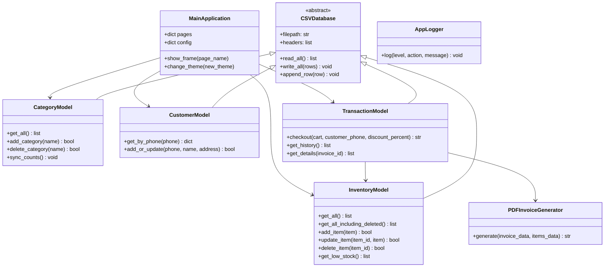

# OpenCart Python Billing System - Context & Architecture

This document provides a high-level overview of the application context, architectural patterns, database models, and UI frame structures. It serves as a persistent context record for developers and AI models.

## 1. System Overview
The application is a full-screen desktop application for shopping malls, designed to help shopkeepers manage their inventory, maintain a multi-cart billing system, register customer details, generate and print PDF invoices, and log system operations.

### Technology Stack
*   **Language:** Python 3.8+ (Strict OOP)
*   **UI Framework:** Tkinter styled with `ttkbootstrap` (Dark/Light themes support)
*   **Database:** CSV flat-files (Thread-safe, temporary-file write pattern)
*   **Configuration:** JSON (`data/settings.json`)
*   **Logging:** Python standard `logging` library (Daily rotating files)
*   **PDF Generation:** `reportlab` or `fpdf2` library

---

## 2. Directory Structure
```text
OpenCart-Billing/
│
├── main.py                 # Application Entry Point, Navigation, & View Screens
├── database.py             # CSV Data Access Object (DAO) classes
├── utils.py                # Logging, PDF invoice generator, and helper utilities
├── documentation/          # Context, process, and task lists
│   ├── context.md          # [This File] Architecture & Schemas
│   ├── tasks.md            # Work items list and status
│   └── process.md          # Development and validation guidelines
├── data/                   # Data Storage Folder (CSV and JSON configs)
│   ├── settings.json       # App theme configurations
│   ├── inventory.csv       # Product items catalog (contains quantity)
│   ├── deleted_inventory.csv# Soft-deleted inventory items archive
│   ├── categories.csv      # Categories and cached product counts
│   ├── customers.csv       # Registered customers directory
│   ├── transactions.csv    # Checkout invoice records
│   └── transaction_items.csv# Line item details for checked-out invoices
├── logs/                   # Log folder with daily rotating files
└── bills/                  # Generated invoice PDFs
```

---

## 3. Data Schemas

### data/settings.json
Stores general configurations.
```json
{
    "theme": "darkly"
}
```

### data/inventory.csv
```text
item_id,name,category,price,quantity,date_added,mfg_date,expiry_date
```
*   `item_id`: String (`ITEM-[10 random digits]`)
*   `name`: String
*   `category`: String (Foreign key to `categories.csv`)
*   `price`: Float
*   `quantity`: Integer (Current physical stock)
*   `date_added`: String (`YYYY-MM-DD`)
*   `mfg_date`: String (`YYYY-MM-DD`)
*   `expiry_date`: String (`YYYY-MM-DD`)

### data/deleted_inventory.csv
Stores the details of soft-deleted items. Structure is identical to `data/inventory.csv`.
*   `item_id`, `name`, `category`, `price`, `quantity`, `date_added`, `mfg_date`, `expiry_date`

### data/categories.csv
```text
category_name,total_items
```
*   `category_name`: String (Primary key)
*   `total_items`: Integer (Cached count of distinct active item IDs under this category)

### data/customers.csv
```text
phone,name,address
```
*   `phone`: String (Unique primary key, normalized to 10 digits)
*   `name`: String
*   `address`: String (Optional)

### data/transactions.csv
```text
invoice_id,timestamp,customer_phone,subtotal,discount_percent,grand_total
```
*   `invoice_id`: String (`INVO-[10 random digits]`)
*   `timestamp`: String (`YYYY-MM-DD HH:MM:SS`)
*   `customer_phone`: String (Foreign key to `customers.csv`)
*   `subtotal`: Float
*   `discount_percent`: Float (0.0 to 100.0)
*   `grand_total`: Float (Round to 2 decimal places)

### data/transaction_items.csv
```text
invoice_id,item_id,quantity,price_at_sale
```
*   `invoice_id`: String (Foreign key to `transactions.csv`)
*   `item_id`: String (Foreign key to `inventory.csv`)
*   `quantity`: Integer
*   `price_at_sale`: Float (Snapshot of unit price at purchase time)

---

## 4. Class & OOP Design Patterns



### Thread-Safe CSV Writes (Write-Replace Pattern)
To avoid data loss or corruption during file writing (e.g. power failure, app crash mid-write):
1.  Read original records.
2.  Perform modifications in memory.
3.  Write new dataset to `data/temp_[filename].csv`.
4.  Rename/replace original file with the temp file atomically using `os.replace`.
