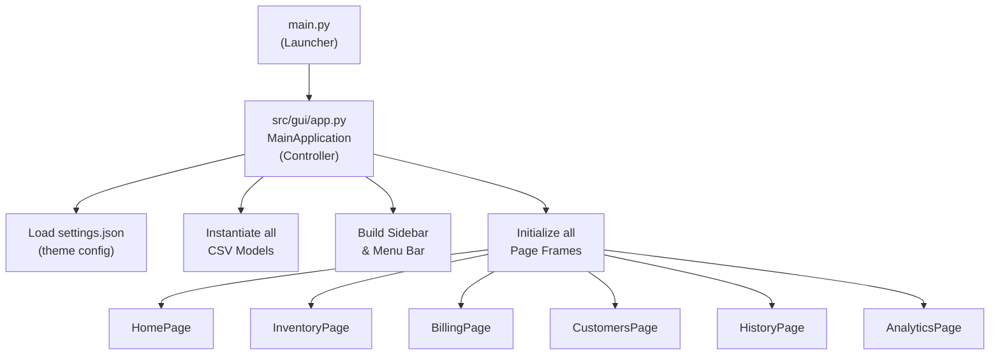
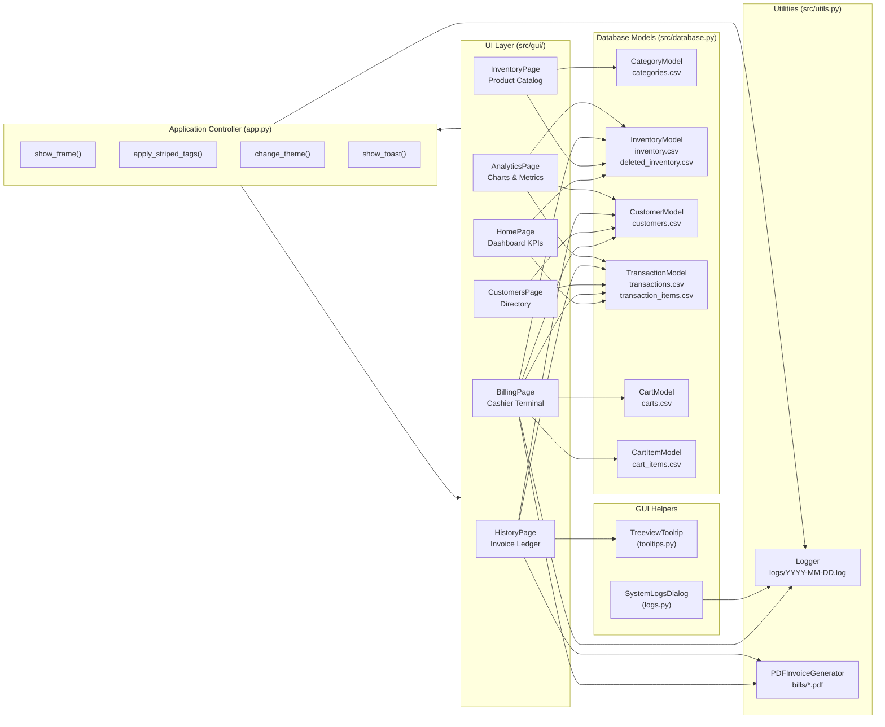
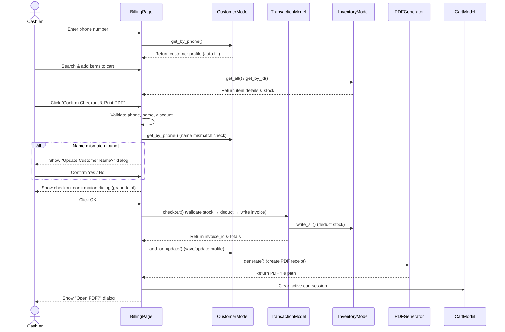
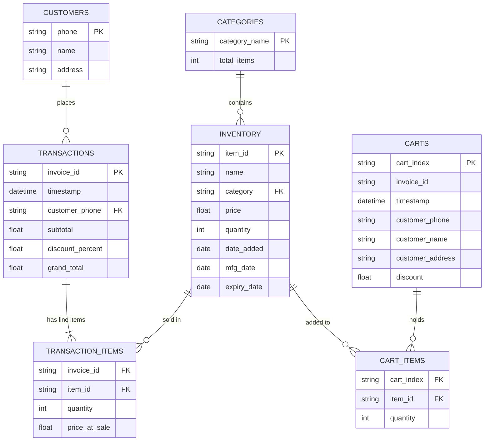

# OpenCart Billing System — High-Level Data Flow Diagram

This document describes how data moves between the UI views, the backend models, the CSV databases, and the utility components within the OpenCart Python Billing System.

---

## Application Entry Flow

---

## Full System Data Flow

---

## Billing Checkout Flow

---

## CSV Database Schema

